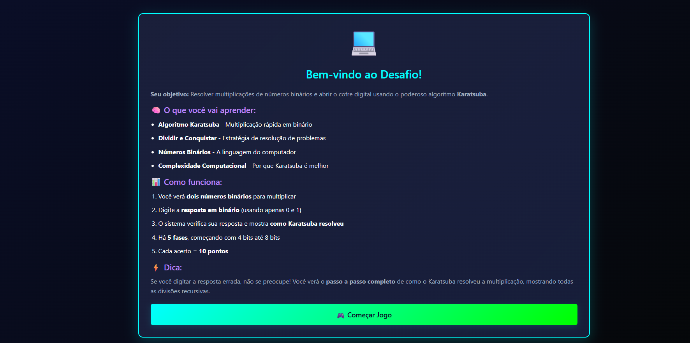
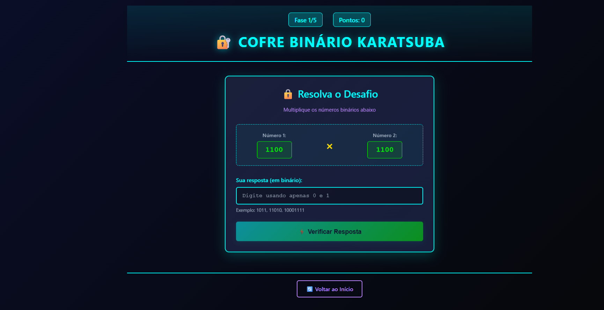
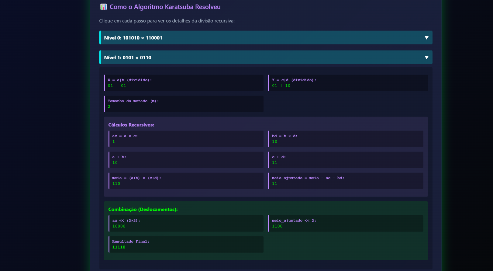

# Cofre Binário Karatsuba

Número da Lista: 50<br>
Conteúdo da Disciplina: Dividir e Conquistar<br>

## Aluno
| Matrícula | Aluno |
| -- | -- |
| 21/1031790 | Oscar de Brito |
| 21/1063013 | Renata Quadros Kurzawa |

## Vídeo de Apresentação
link: https://youtu.be/uSxDb7RCUg8

[](https://youtu.be/uSxDb7RCUg8)

## Sobre
Cofre Binário Karatsuba é um jogo educativo com foco em conceitos de algoritmos de Dividir e Conquistar, especificamente o algoritmo de Karatsuba em números binários.

Objetivos do projeto:
- implementar o algoritmo de Karatsuba;
- demonstrar multiplicação rápida usando estratégia de Dividir e Conquistar;
- visualizar recursão e passos computacionais de forma interativa;

Como funciona:
1. Sistema gera dois números binários aleatórios conforme a fase.
2. Jogador digita o resultado da multiplicação em binário.
3. Sistema valida a resposta usando o algoritmo Karatsuba.
4. Feedback visual mostra se acertou/errou com os passos recursivos completos.
5. Progressão por 5 fases (4 bits até 8 bits) com pontuação cumulativa (máx 50 pontos).

## Estrutura do Projeto

```
G50_Dividir_e_Conquistar/
├── app.py              # Rotas Flask
├── karatsuba.py        # Algoritmo Karatsuba
├── utils.py            # Funções auxiliares binárias
├── game.py             # Lógica de jogo
├── templates/
│   ├── index.html      # Página inicial
│   ├── game.html       # Tela do jogo
│   └── result.html     # Página de resultado
├── static/
│   ├── style.css       # Estilos (dark mode)
│   └── script.js       # Lógica frontend
└── README.md           # Este arquivo
```

## Screenshots





## Instalação
Linguagem: Python 3.7+<br>
Framework: Flask (backend) + HTML/CSS/JavaScript (frontend)<br>
Banco de dados: Não utiliza (session Flask)<br>

Pré-requisitos:
- Python 3.7 ou superior instalado;
- pip disponível;
- ambiente virtual recomendado.

Passo a passo:

```bash
# clonar o repositório
git clone <URL_DO_REPOSITORIO>
cd G50_Dividir_e_Conquistar

# instalar dependências
pip install flask
```

## Uso

```bash
python app.py
```

Depois, abra no navegador:

```text
http://localhost:5000
```

Fluxo do jogo:
1. Clicar em "🎮 Começar Jogo" na página inicial.
2. Visualizar dois números binários a multiplicar (Fase 1: 4 bits).
3. Digitar a resposta usando apenas 0 e 1.
4. Sistema valida com Karatsuba e mostra feedback (acerto/erro + passos recursivos).
5. Avançar por 5 fases progressivas até completar o jogo e ver pontuação final (máximo 50).
